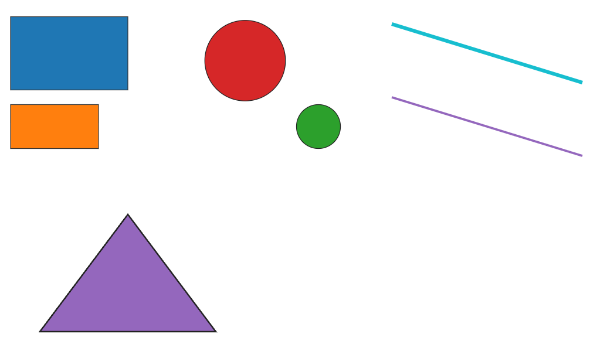
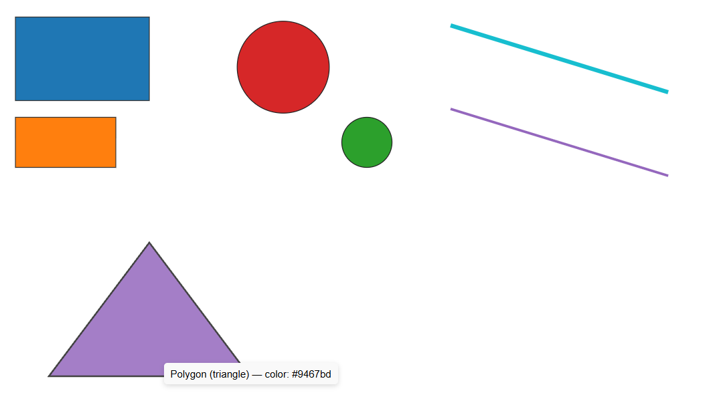

Assignment 1 - Leala Carbonneau

Sources:
https://d3-graph-gallery.com/graph/shape.html

https://d3-graph-gallery.com/graph/interactivity_tooltip.html

I created 2 rectangles of different sizes, 2 circles of different sizes, 2 lines of different sizes and a triangle. All of the shapes are filled with different colors. All of the shapes include an interactive tooltip that shows the name of the shape and the color when the shape is hovered over.

Design Achievements:
- Different colors
- Different sizes
- Outlines
- Opacity lowers when hovered over

Technical Achievements:
- Interactive tooltip
- Description of shape and color
- Positioning x and y
